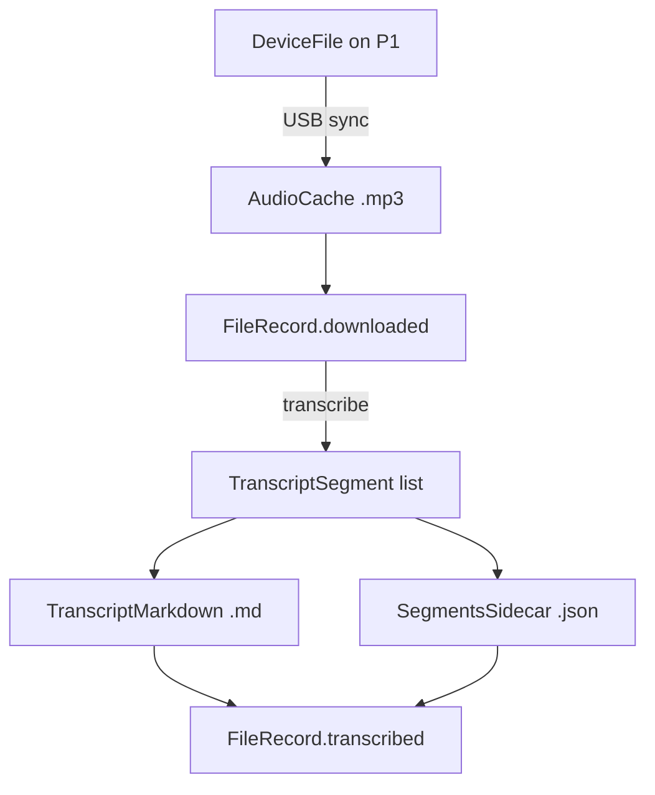

# Entity Relationship Diagram (ERD)

**Product:** hinotes_organizer  
**Last updated:** 2026-05-23

Related docs: [PRD](PRD.md) · [Research & approach](research-and-approach.md)

This document describes the **logical data model** for the HiDock local transcript pipeline — what entities exist, how they relate, and where they are stored.

---

## 1. Overview diagram

```mermaid
erDiagram
    HiDockDevice ||--o{ DeviceFile : stores
    DeviceFile ||--o| FileRecord : tracked_by
    FileRecord ||--o| AudioCache : downloads_to
    FileRecord ||--o| TranscriptMarkdown : produces
    TranscriptMarkdown ||--o| SegmentsSidecar : references
    Config ||--|| PipelineState : configures
    PipelineState ||--o{ FileRecord : contains
    Config ||--|| OutputLocation : defines

    HiDockDevice {
        string model "hidock-p1"
        int storage_used_mb
        int storage_capacity_mb
    }

    DeviceFile {
        string name "2026May21-154615-Rec58.hda"
        string signature PK "MD5 hex, 32 chars"
        int length_bytes
        datetime recorded_at
        string kind "Rec | Wip"
    }

    FileRecord {
        string signature PK FK
        string device_file
        datetime recorded_at
        datetime downloaded_at
        string audio_path
        datetime transcribed_at
        string markdown_path
        string segments_path
    }

    AudioCache {
        string path "cache_dir/name.mp3"
        int bytes
    }

    TranscriptMarkdown {
        string path PK
        string title
        string date
        string source
    }

    SegmentsSidecar {
        string path PK
        json segments
    }

    PipelineState {
        string state_file "JSON path"
    }

    Config {
        yaml output
        yaml audio
        yaml sync
        yaml transcription
        yaml markdown
    }

    OutputLocation {
        string dir
        string filename_pattern
    }
```

---

## 2. Entity definitions

### 2.1 HiDockDevice (runtime, not persisted)

Physical USB device. Exists only while connected.

| Attribute | Type | Source |
|---|---|---|
| `model` | string | USB product ID → `hidock-p1` |
| `storage_used_mb` | int | `ReadCardInfo` command |
| `storage_capacity_mb` | int | `ReadCardInfo` command |

**Relationship:** One device holds many `DeviceFile` records.

---

### 2.2 DeviceFile (on-device)

A recording stored on the HiDock SD card. Listed via USB `QueryFileList`.

| Attribute | Type | Notes |
|---|---|---|
| `signature` | string (PK) | MD5 hex; stable dedup key |
| `name` | string | e.g. `2026May21-154615-Rec58.hda` |
| `length` | int | Bytes on device |
| `time` | datetime | Parsed from filename |
| `version` | int | Format version byte |
| `kind` | string | `Rec` (full) or `Wip` (partial) |

**Cardinality:** Each `DeviceFile` maps to at most one `FileRecord` in pipeline state (by `signature`).

**Source:** `device_usb` → `HiDockDevice.listFiles()`

---

### 2.3 FileRecord (pipeline state)

Tracks processing lifecycle for one recording. Persisted in `.state/pipeline.json`.

| Attribute | Type | Nullable | Set when |
|---|---|---|---|
| `signature` | string (PK) | No | First seen on device |
| `device_file` | string | No | Sync |
| `recorded_at` | ISO datetime | Yes | Sync (from device list) |
| `downloaded_at` | ISO datetime | Yes | After USB download |
| `audio_path` | string | Yes | After USB download |
| `transcribed_at` | ISO datetime | Yes | After transcription |
| `markdown_path` | string | Yes | After transcription |
| `segments_path` | string | Yes | After transcription (if enabled) |

**State transitions:**

```
(new) → downloaded → transcribed
         ↑              ↑
      sync           transcribe
```

**Source:** `hidock/state.py` → `FileRecord`, `PipelineState`

**JSON shape:**

```json
{
  "files": {
    "e9b8238c9043647a...": {
      "signature": "e9b8238c9043647a...",
      "device_file": "2026May21-154615-Rec58.hda",
      "recorded_at": "2026-05-21T15:46:15.000Z",
      "downloaded_at": "2026-05-23T10:00:00.000Z",
      "audio_path": ".cache/audio/2026May21-154615-Rec58.mp3",
      "transcribed_at": "2026-05-23T10:15:00.000Z",
      "markdown_path": "/path/to/vault/.../2026-05-21_Recording_Rec58_e9b8238c.md",
      "segments_path": "/path/to/vault/.../2026-05-21_Recording_Rec58_e9b8238c.segments.json"
    }
  }
}
```

---

### 2.4 AudioCache (filesystem)

Local copy of device audio. Not a separate DB — path stored on `FileRecord.audio_path`.

| Attribute | Type | Notes |
|---|---|---|
| `path` | string | `{audio.cache_dir}/{device_name}.mp3` |
| `bytes` | int | Should match `DeviceFile.length` |

**Convention:** `.hda` renamed to `.mp3` on download (treated as MP3 payload).

---

### 2.5 TranscriptMarkdown (filesystem output)

Obsidian-ready markdown file.

| Attribute | Location | Notes |
|---|---|---|
| Front matter | YAML header | See PRD §9.2 |
| Body | `# Raw Transcript` | `Speaker N: text` lines |
| Path | `{output.dir}/{pattern}.md` | From config |

**Relationship:** One markdown file per `FileRecord` (1:1 after transcribe).

**Source:** `hidock/markdown.py` → `write_transcript_markdown()`

---

### 2.6 SegmentsSidecar (filesystem output, optional)

JSON file with per-utterance timestamps. Enabled by `markdown.save_segments_json`.

| Attribute | Type | Notes |
|---|---|---|
| `device_file` | string | Copy from source |
| `signature` | string | Copy from source |
| `recorded_at` | string | ISO datetime |
| `segments` | array | See below |

**Segment object:**

| Field | Type | Example |
|---|---|---|
| `start` | float (seconds) | `0.0` |
| `end` | float (seconds) | `5.2` |
| `speaker` | string | `Speaker 1` |
| `text` | string | `Hello everyone.` |

**Relationship:** Referenced from markdown front matter via `segments_file` (basename only). 1:1 with parent markdown.

**Source:** `hidock/markdown.py` → `write_segments_json()`

---

### 2.7 Config (YAML file)

User configuration. Not in pipeline state — read at CLI startup.

| Section | Key entities influenced |
|---|---|
| `output` | `OutputLocation`, markdown paths |
| `audio` | `AudioCache` root |
| `sync` | Wip filter, delete behavior |
| `transcription` | Whisper/pyannote settings |
| `markdown` | Front matter defaults, sidecar toggle |
| `secrets` | `hf_token`, `hinotes_token` (gitignored via `config.yaml`) |
| `state_file` | `PipelineState` path |

**Source:** `config.yaml` (from `config.example.yaml`), loaded by `hidock/config.py`

---

### 2.8 OutputLocation (derived from Config)

| Attribute | Type | Example |
|---|---|---|
| `dir` | path | `.../Transcripts/HiDock` |
| `filename_pattern` | string | `{date}_{title}_{id}` |

**Resolved transcript dir:** `{dir}/`

---

## 3. Pipeline flow (data lifecycle)



---

## 4. Secondary path: HiNotes cloud (out of band)

A separate, optional data flow — not part of the main ERD above.

| Entity | Storage | Key |
|---|---|---|
| HiNotes note | HiNotes cloud | `note_id` |
| Exported transcript | `./output/transcripts/` | `.sync_state.json` tracks synced note IDs |

Tools: `hinotes/client.py`, `scripts/sync_transcripts.py`

This path does **not** share `FileRecord` or device `signature` with the USB pipeline.

---

## 5. Identifiers summary

| Entity | Primary key | Dedup strategy |
|---|---|---|
| DeviceFile | `signature` (MD5) | Same file always same signature |
| FileRecord | `signature` | One record per device file |
| TranscriptMarkdown | file path | Filename includes `{id}` = signature prefix |
| HiNotes note | `note_id` | Separate `.sync_state.json` |

---

## 6. File system map

```
hinotes_organizer/
├── config.yaml                          → Config
├── .state/pipeline.json                 → PipelineState
├── .cache/audio/*.mp3                   → AudioCache
└── {output.dir}/                        → TranscriptMarkdown + SegmentsSidecar
    ├── 2026-05-21_Recording_Rec58_e9b8238c.md
    └── 2026-05-21_Recording_Rec58_e9b8238c.segments.json
```

---

## 7. Future entities (not implemented)

| Entity | Purpose |
|---|---|
| `SpeakerProfile` | Map `Speaker 1` → display name across meetings |
| `CalendarEvent` | Enrich title from calendar API |
| `TranscriptionJob` | Queue state for background processing |

See [PRD.md](PRD.md) Phase 2–3.
