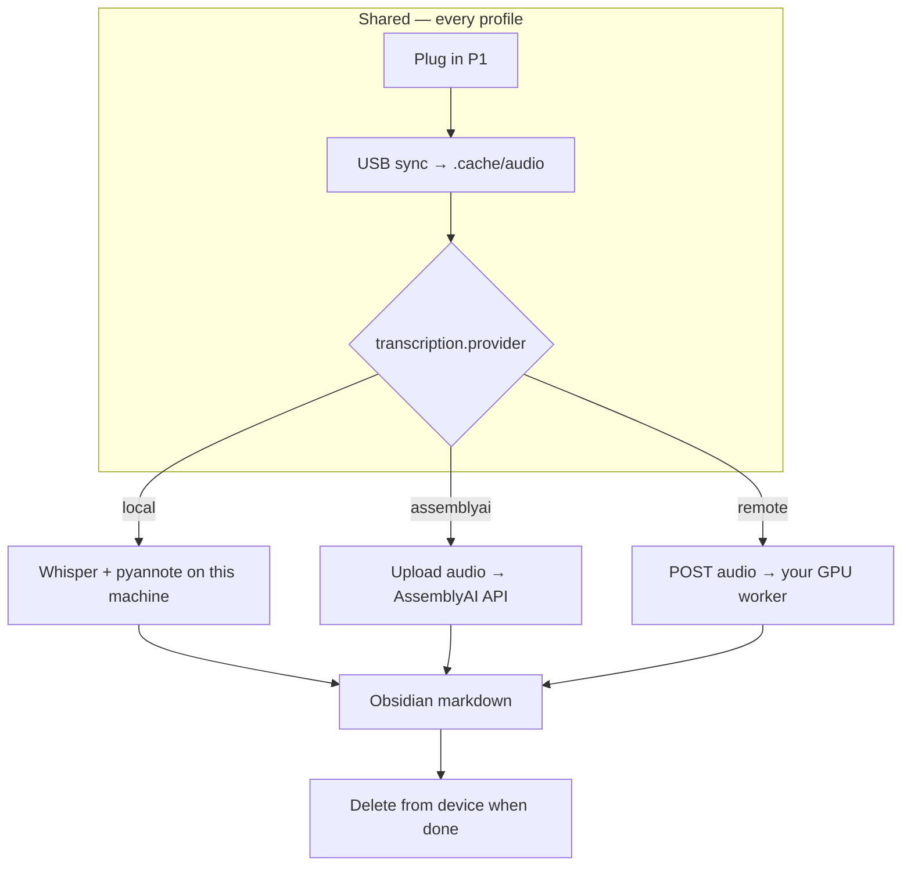

# Product Requirements Document (PRD)

**Product:** hinotes_organizer — HiDock transcript pipeline  
**Last updated:** 2026-05-24  
**Status:** MVP in progress; processing profiles defined

Related docs: [ERD](ERD.md) · [Research & approach](research-and-approach.md)

---

## 1. Overview

A tool that automates the path from **HiDock P1 recordings** to **Obsidian-ready markdown transcripts** — without HiNotes cloud, without AI summaries, and without manual copy-paste.

```
HiDock P1 (USB) → sync audio → transcribe (local | cloud | self-hosted) → markdown in vault
```

The output format mirrors existing **Fireflies** transcript files (YAML front matter + `# Raw Transcript` body with speaker labels).

**Processing is pluggable.** Users pick a profile based on compute, privacy, and which laptop they have plugged in — but USB sync, state tracking, markdown shape, and optional device cleanup stay the same.

---

## 1.1 Processing profiles (target)

| Profile | `transcription.provider` | Who it's for | Privacy | Speed |
|---|---|---|---|---|
| **A — Local** | `local` | Capable laptop or always-plugged-in Mac | Best — audio never leaves machine | Slow on CPU; fast with GPU |
| **B — Cloud** | `assemblyai` | Any laptop; privacy not a concern | Audio sent to AssemblyAI | Fast (~minutes per file) |
| **C — Self-hosted** | `remote` | Privacy-sensitive; own GPU server/PC | Audio stays on your infra | Fast on GPU; upload optional |

All profiles share:

- Phase 1 **USB sync** (Node + `device_usb/`)
- Same **markdown + `.segments.json`** output
- Same **state keyed by device signature**
- **Delete from device after success** (critical for multi-laptop use)



### Profile A — Local (current MVP)

Everything on the machine that has the HiDock plugged in: download → Whisper → pyannote → markdown.

- **Best when:** gaming PC / M-series Mac with patience, or short meetings only on a weak laptop
- **Config:** `transcription.provider: local`, optional `device: cuda` on GPU machines

### Profile B — Cloud (AssemblyAI)

Sync on any laptop; send cached `.mp3` to [AssemblyAI](https://www.assemblyai.com/pricing/) for transcript + speaker diarization in one API call.

- **Best when:** work/personal/company laptops without GPU; backlog must finish in hours not days
- **Cost:** ~$0.15–0.35/hr audio (see research doc); ~$20–40 one-time for ~110 hr backlog
- **Config:** `secrets.assemblyai_api_key`, `transcription.provider: assemblyai`
- **Tradeoff:** audio and transcript pass through a third party — check employer policy

### Profile C — Self-hosted remote worker

Privacy like local, speed like cloud — but **you** run the transcribe service (same Whisper + pyannote stack) on a home PC, NAS, or server with a GPU.

Two deployment patterns:

| Pattern | HiDock plugged into… | How transcribe runs | ~100 MB file |
|---|---|---|---|
| **C1 — Direct (recommended)** | GPU machine | Full `run` locally on that box | USB download only — **no network upload** |
| **C2 — Remote worker** | Any laptop | Laptop syncs → POST audio to worker URL | LAN upload ~1 s; WAN depends on link |

**Should you plug into the GPU machine?** For self-hosted, **yes when you can** — it is the simplest and fastest path. USB download (~1–2 min for 100 MB) is usually similar whether the file is uploaded afterward or not; skipping upload avoids extra moving parts.

**When C2 still makes sense:** company laptop at the office — sync there, send audio to a home worker over **Tailscale/VPN** (HTTPS). A 100 MB upload on a gigabit home LAN is ~1 second; over 20 Mbps uplink ~40 seconds — often acceptable vs hours of laptop CPU.

- **Config (planned):** `transcription.provider: remote`, `transcription.remote_url`, optional API token
- **Worker (planned):** small HTTP service on GPU host; accepts audio + returns segments JSON or normalized transcript

---

## 1.2 Multi-laptop behavior

Users may plug the same HiDock into **personal**, **company**, or **home** machines. Local `.state/pipeline.json` does **not** sync between laptops.

**Device is the shared queue.** After a recording is fully processed, it must be **removed from the HiDock** so the next laptop does not re-download and re-transcribe it.

| Event | Requirement |
|---|---|
| Transcript written to Obsidian vault | Source of truth for "done" (vault syncs via iCloud/Drive/git) |
| Delete from device | After successful transcribe + markdown write (not download-only) |
| Re-run on same laptop | Idempotent via local state + signature |

**Config:** `sync.delete_after_transcribe` — defaults to `true` for `assemblyai` and `remote`, `false` for `local`. Set explicitly when using local transcription across multiple laptops.

---

## 2. Problem

| Today (HiNotes manual) | Pain |
|---|---|
| Transfer files in browser | Requires HiNotes tab + USB |
| Click **Generate Now** | Often mandatory in v3 before transcript exists |
| Wait for cloud processing | Slow, quota-bound |
| Copy transcript to knowledge base | Manual, error-prone |
| Summaries generated | Unwanted; user only wants raw transcript |

---

## 3. Goals

| # | Goal |
|---|---|
| G1 | Pull new recordings from HiDock P1 over USB without HiNotes |
| G2 | Transcribe locally with **speaker labels** |
| G3 | Write transcripts to a **configurable Obsidian path** |
| G4 | Store **timestamps as metadata** (not inline in readable body) |
| G5 | Track sync/transcribe state so reruns are idempotent |
| G6 | Support **local, cloud, and self-hosted** transcribe backends behind one CLI |
| G7 | Avoid duplicate work across laptops (delete from device when done) |
| G8 | Keep HiNotes out of the primary transcript path |

---

## 4. Non-goals

| # | Out of scope (for now) |
|---|---|
| NG1 | AI meeting summaries |
| NG2 | Named speaker recognition across meetings (“this is always Alice”) |
| NG3 | Calendar-based meeting titles |
| NG4 | HiNotes device transfer automation via cloud API |
| NG5 | Mobile app or GUI |
| NG6 | Real-time / live transcription |
| NG7 | Multi-tenant SaaS hosted by project maintainers |
| NG8 | HiNotes as primary transcript source |

---

## 5. Users

**Primary:** Single user (owner of HiDock P1) syncing personal/work meeting recordings into an Obsidian vault — possibly from **more than one laptop**.

**Profile fit:**

| User situation | Likely profile |
|---|---|
| Strong GPU laptop or home PC | A local, or C1 direct |
| Any laptop, OK with cloud | B AssemblyAI |
| Confidential audio, own GPU at home | C1 when home, or C2 remote worker |
| Weak CPU MacBook, mixed contexts | B or C (not A for long backlog) |

---

## 6. User stories

| ID | Story | Priority |
|---|---|---|
| US-1 | As a user, I plug in my P1 and run one command to sync new recordings to my Mac | P0 |
| US-2 | As a user, I run one command to transcribe synced audio with speaker labels | P0 |
| US-3 | As a user, I find new `.md` files in my Obsidian vault under a configurable folder | P0 |
| US-4 | As a user, I can re-run sync/transcribe without duplicating work | P0 |
| US-5 | As a user, I configure the output directory for my Obsidian vault | P0 |
| US-6 | As a user, I access per-utterance timestamps via a sidecar file | P1 |
| US-7 | As a user, I transcribe a single file for testing (`download` + `--limit 1`) | P1 |
| US-8 | As a user, recordings are **removed from the device after successful transcribe** so another laptop does not redo them | P0 |
| US-9 | As a user, I skip partial `Wip*.hda` clips by default | P1 |
| US-10 | As a user, I get a clear error when Chrome/HiNotes blocks USB | P1 |
| US-11 | As a user, I choose **local vs AssemblyAI vs remote worker** in config | P1 |
| US-12 | As a user on a weak laptop, I use cloud/remote transcribe without local GPU setup | P1 |
| US-13 | As a privacy-conscious user, I run a **self-hosted worker** on my own GPU machine | P2 |

**Secondary use:** Pulling already-cloud-transcribed notes from HiNotes via unofficial API (`scripts/sync_transcripts.py`) — maintained but not the main product.

---

## 7. Functional requirements

### 7.1 USB sync

| ID | Requirement | Status |
|---|---|---|
| FR-1 | List all `Rec*.hda` files on connected P1 | Done |
| FR-2 | Download new files not yet in pipeline state | Done |
| FR-3 | Save downloaded files as `.mp3` in configurable cache dir | Done |
| FR-4 | Key files by device MD5 **signature** for dedup | Done |
| FR-5 | Optionally include `Wip*.hda` files (`sync.include_wip`) | Done |
| FR-6 | Delete from device after **successful transcribe** (configurable) | Planned |
| FR-7 | Fail with actionable message if USB locked by Chrome | Done |

### 7.2 Transcription

| ID | Requirement | Status |
|---|---|---|
| FR-8 | Transcribe via pluggable **provider** (`local` \| `assemblyai` \| `remote` \| `custom`) | Partial (`local` + plugin API) |
| FR-9 | **Local:** faster-whisper + pyannote diarization | Done |
| FR-10 | **AssemblyAI:** upload audio, speaker diarization, map to same segment shape | Planned |
| FR-11 | **Remote:** POST audio to self-hosted worker; same segment shape | Planned |
| FR-11a | **Custom:** load user `Transcriber` class from `transcription.custom_class` | Done |
| FR-12 | Configurable model, device, language (local / worker) | Done (local) |
| FR-13 | Skip already-transcribed files unless `--force` | Done |
| FR-14 | Support `--limit N` and `--reuse-whisper` (local cache) | Done |

### 7.3 Output

| ID | Requirement | Status |
|---|---|---|
| FR-15 | Write markdown with YAML front matter | Done |
| FR-16 | Body format: `Speaker N: utterance` under `# Raw Transcript` | Done |
| FR-17 | Filename pattern configurable (`{date}_{title}_{id}`) | Done |
| FR-18 | Write `.segments.json` sidecar with start/end/speaker/text | Done |
| FR-19 | Front matter includes `recorded_at`, `device_file`, `signature` | Done |
| FR-20 | Same markdown shape regardless of provider | Done (local) |

### 7.4 CLI

| ID | Command | Status |
|---|---|---|
| FR-21 | `list` — show device files | Done |
| FR-22 | `sync` — download new files | Done |
| FR-23 | `download <name>` — single file | Done |
| FR-24 | `transcribe` — process cached audio | Done |
| FR-25 | `run` — sync then transcribe | Done |
| FR-26 | `device-clean` / `device-rm` — manual device storage management | Done |

---

## 8. Non-functional requirements

| ID | Requirement |
|---|---|
| NFR-1 | **Privacy** — local and self-hosted paths keep audio on user-controlled hardware |
| NFR-2 | **Cost** — local/self-hosted $0 marginal; cloud profile is opt-in with predictable per-minute pricing |
| NFR-3 | **Idempotency** — safe to re-run; state tracked in `.state/pipeline.json` |
| NFR-4 | **Portability** — macOS primary; Linux on GPU worker; Node 22+ + Python 3.10+ |
| NFR-5 | **Simplicity** — vendored USB protocol in-repo; one CLI for all profiles |
| NFR-6 | **Obsidian compatibility** — plain markdown + YAML; no proprietary plugins required |
| NFR-7 | **Multi-laptop** — device cleanup prevents duplicate sync/transcribe across machines |

---

## 9. Output specification

### 9.1 Path layout

```
{output.dir}/{date}_{title}_{id}.md
{output.dir}/{date}_{title}_{id}.segments.json   # when save_segments_json: true (default)
```

Example:

```
Transcripts/HiDock/2026-01-15_Recording_Rec12_a1b2c3d4.md
```

Fireflies reference layout:

```
Transcripts/Fireflies/kite/2026-05-21_Weekly_AI_Practice_Sharing_Session_01KRN0YZ2ZW1WDPRAGHTDN2MGT.md
```

### 9.2 Markdown front matter

| Field | Required | Example |
|---|---|---|
| `title` | Yes | `Recording Rec12` |
| `date` | Yes | `2026/01/15` |
| `recorded_at` | Yes | `2026-01-15T10:30:00` |
| `device_file` | Yes | `2026Jan15-103000-Rec12.hda` |
| `signature` | Yes | MD5 hex (32 chars) |
| `source` | Yes | `HiDock` |
| `tags` | Yes | `[transcript, hidock, meeting]` |
| `duration_seconds` | No | `3600.0` |
| `segments_file` | No | basename of sidecar JSON (default: written when `save_segments_json: true`) |

### 9.3 Body

```markdown
# Raw Transcript

Speaker 1: Hello everyone.
Speaker 2: Thanks for joining.
```

No inline timestamps in body — those live in `.segments.json`.

---

## 10. Phases

### Phase 1 — MVP (current)

- [x] USB list + download
- [x] Local transcription + diarization (Profile A)
- [x] Fireflies-style markdown output
- [x] Configurable paths and state tracking
- [x] Whisper result cache (`--reuse-whisper`)
- [ ] End-to-end test on one real recording (local)
- [x] `delete_after_transcribe` wired in pipeline

### Phase 2 — Cloud + multi-laptop

- [x] **Profile B:** AssemblyAI adapter (`transcription.provider: assemblyai`)
- [x] Config schema: provider, API keys, remote URL
- [x] Delete from device after successful transcribe (default on for cloud/remote)
- [x] README: multi-laptop workflow + privacy notes for work use
- [ ] USB plug-in trigger (launchd) optional

### Phase 3 — Self-hosted worker

- [x] **Profile C2:** minimal transcribe HTTP worker (GPU host)
- [x] Client: upload cached audio, receive segments (503 retry when busy)
- [x] Document **Profile C1** (plug HiDock into GPU machine — no worker needed)
- [x] Tailscale/VPN guidance for remote worker
- [x] Background job queue on worker (one GPU job at a time)

### Phase 4 — Enhancements (optional)

- [ ] Speaker name mapping library
- [ ] Calendar title enrichment
- [ ] Additional cloud adapters (Deepgram)

---

## 11. Success metrics

| Metric | Target |
|---|---|
| Manual steps per new recording | 1 command (`run`) or 2 (`sync` + `transcribe`) |
| HiNotes dependency for transcripts | None |
| Duplicate transcript files on re-run | 0 |
| Duplicate download on second laptop (after done) | 0 (device cleaned) |
| API cost (Profile B) | User-controlled; ~$2–4 / 10 hr month typical |
| Time to first transcript (Profile B) | Minutes after sync |
| Time to first transcript (Profile A, CPU laptop, 40 min meeting) | Tens of minutes acceptable for testing only |

---

## 12. Constraints & dependencies

| Constraint | Detail |
|---|---|
| USB lock | Close Chrome/HiNotes before sync |
| Node 22+ | Required for `device_usb/` |
| libusb | `brew install libusb` on macOS |
| HF token | Required for local/self-hosted pyannote; accept [community-1](https://huggingface.co/pyannote/speaker-diarization-community-1) |
| Compute | Profile A on CPU laptop is too slow for large backlogs |
| Multi-laptop | Requires device delete + synced Obsidian vault |
| Employer policy | Profile B may be disallowed for confidential meetings |
| Titles | Device filenames lack meeting names; manual rename in Obsidian |

### Planned config (transcription)

```yaml
transcription:
  provider: local          # local | assemblyai | remote
  model: medium            # local / worker only
  device: auto             # local / worker only: auto | cpu | cuda
  diarize: true

secrets:
  hf_token: ""             # local + self-hosted worker
  assemblyai_api_key: ""   # profile B

# remote worker (profile C2)
# transcription:
#   provider: remote
#   remote_url: https://transcribe.home.example/v1/transcribe
#   remote_token: ""

sync:
  delete_after_transcribe: false   # default true for assemblyai/remote; set explicitly for local multi-laptop
```

### Transcriber plugin API

All backends implement `hidock.transcribers.base.Transcriber`:

| Method | Purpose |
|---|---|
| `from_config(config)` | Factory — read secrets and options |
| `prepare(audio_paths, reuse_cache=...)` | Optional batch setup (load models) |
| `transcribe(audio_path, reuse_cache=...)` | Return `TranscriptionResult(segments, duration_seconds)` |
| `close()` | Release resources |
| `supports_cache_reuse()` | Whether `--reuse-whisper` applies |

**Custom provider:** subclass `Transcriber`, set `provider: custom` and `custom_class: package.module.Class`. Reference stub: `hidock.transcribers.example_custom.EchoTranscriber`.

Output contract: `segments` is a list of `TranscriptSegment(start, end, speaker, text)` — same shape for markdown writer regardless of backend.

---

## 13. Open items

1. End-to-end validation — local profile on one ~40 min recording
2. Confirm `.hda` → MP3 assumption on all firmware versions
3. Backfill strategy: Profile B for 220-file / ~54 GB backlog vs C1 overnight on home PC
4. Company-laptop policy doc: when to use B vs C vs local-only

---

## 14. References

- [ERD.md](ERD.md) — data model
- [research-and-approach.md](research-and-approach.md) — technical research and alternatives
- [README.md](../README.md) — user setup and usage
