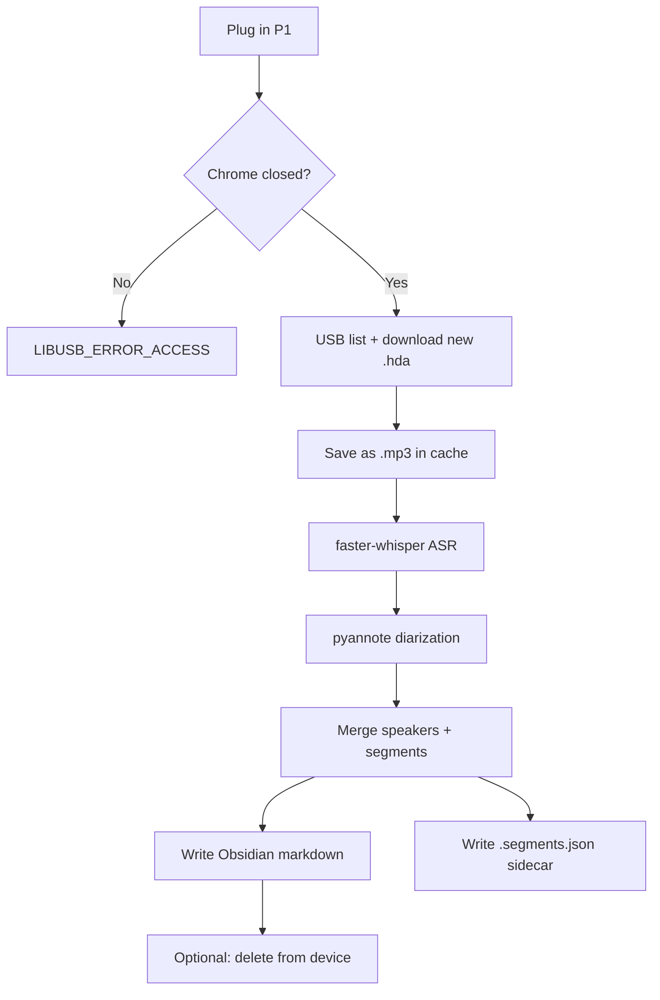

# HiDock P1 → Local Transcripts: Research & Approach

**Last updated:** 2026-05-23  
**Device:** HiDock P1 (`hidock-p1`, USB vendor `0x10D6`)

**Related docs:** [PRD](PRD.md) · [ERD](ERD.md) · [README](../README.md) (user guide)

This document captures **technical research and design rationale**. For product requirements see [PRD.md](PRD.md); for the data model see [ERD.md](ERD.md).

---

## Problem statement

The manual HiNotes workflow is slow and hard to automate:

1. Plug in device → transfer recordings in browser
2. Click **Generate Now** (often required in HiNotes v3 before transcript is available)
3. Copy transcript → paste into knowledge base

We want:

- **Transcripts only** — skip AI summaries
- **Speaker labels** — who said what
- **Timestamps in metadata** — not cluttering the readable body
- **Configurable output path** — Obsidian vault, Fireflies-style layout
- **Repeatable automation** — sync new recordings without babysitting the UI

---

## Paths explored

We investigated two approaches. **Local USB (Option A) is the chosen path.**

| Path | Idea | Verdict |
|---|---|---|
| **A. Local USB pipeline** | Pull `.hda` files directly from device → transcribe locally → write markdown | **Chosen** — private, $0 API, full control |
| **B. HiNotes cloud API** | Reverse-engineer web app API → export transcripts after cloud processing | **Secondary** — still needs browser transfer + Generate Now |
| **C. Cloud STT APIs** | Upload audio to AssemblyAI / Deepgram / OpenAI | **Fallback** — good quality, ongoing cost, audio leaves machine |
| **D. HiNotes Pro cloud** | Use built-in transcription + speaker ID | **Avoid** — worst automation story, summary workflow friction |

---

## HiNotes cloud API (Path B)

Full endpoint notes: [`.temporal/logs/hinotes-api-investigation.md`](../.temporal/logs/hinotes-api-investigation.md)

### How auth works

- Token in `localStorage.accessToken` (also `refreshToken`)
- Sent as HTTP header: `accesstoken: <token>`
- Response shape: `{ error: 0, data: ... }` — `error: 10000` = token expired
- Source: reverse-engineered from `https://hinotes.hidock.com/assets/js/index-CCLgxPax.js`

### Workflow → API mapping

| Manual step | API / mechanism |
|---|---|
| Connect device | WebUSB/Bluetooth in browser + `/v1/user/device/list` |
| Transfer recordings | Chunked `POST /v1/user/device/file/upload` |
| Auto transfer setting | `POST /v2/device/setting/save` with `file.auto-transfer` |
| List notes | `GET /v1/note/recording/list` |
| Generate (transcribe + summarize) | `POST /v2/device/recording/transcribe` with `task: "summarize"` |
| Get transcript | `POST /v2/note/transcription/list` |
| Export transcript | `GET /v2/note/export?scope=transcription&export_format=TXT` |

### Why we deprioritized this path

1. **No official public API** — undocumented, may violate ToS, can break anytime
2. **Device transfer still needs browser USB** — hardest step to headless-automate
3. **HiNotes v3** often requires summary generation before transcript is accessible
4. **Login uses reCAPTCHA** — blocks unattended browser automation (Cursor embedded browser failed; Chrome login works)
5. **Chrome holds exclusive USB lock** — even with API access, device sync competes with HiNotes tab

### What we built anyway (secondary tool)

- `hinotes/client.py` — unofficial API client
- `scripts/sync_transcripts.py` — verify / list / export / sync via token

Useful if you already have notes transcribed in HiNotes cloud and just want to pull transcripts. Not a complete replacement for the device workflow.

---

## USB device research (Path A)

### What macOS sees

The P1 does **not** mount as a normal USB drive (no volume in `/Volumes/`). It uses a **proprietary USB protocol** — the same one HiNotes uses via WebUSB in the browser.

- Device name: `HiDock_P1` (vendor `0x10D6`)
- Internal storage chip visible but not exposed as drag-and-drop storage

### Verified on this device (2026-05-23)

After closing Chrome/HiNotes (which held `UsbExclusiveOwner = Google Chrome`):

| Metric | Value |
|---|---|
| Model | `hidock-p1` |
| Storage | ~54.5 GB used / ~59.6 GB total |
| File count | **220** `.hda` files |
| Date range | ~Aug 2025 – May 2026 |

Sample filenames:

```
2026May21-154615-Rec58.hda   ← full recording
2026May20-093951-Rec57.hda
2026Feb04-180230-Wip70.hda   ← partial / whisper clip
```

- **`Rec`** = full meeting recordings (what we sync by default)
- **`Wip`** = shorter partial clips (skipped unless `sync.include_wip: true`)

Each file has an **MD5 signature** (32 hex chars) from the device file list — used as stable ID for dedup/state tracking.

### USB exclusive lock

| Error | Cause | Fix |
|---|---|---|
| `LIBUSB_ERROR_ACCESS` | Chrome/HiNotes owns USB exclusively | Close HiNotes tab or quit Chrome, optionally replug device |

Log: [`.temporal/logs/list_hidock_files.log`](../.temporal/logs/list_hidock_files.log)

### USB protocol (in-repo)

We **vendor our own minimal USB layer** in `device_usb/` — not an external dependency. It implements only what the sync pipeline needs: connect, list files, download, delete, and storage info.

Provenance: derived from [hidock-mcp](https://github.com/kms254/hidock-mcp) v1.0.1 (MIT), with file download added. Wire format matches HiDock's [public test interface](https://hw.test.hidock.com/).

| Command | ID | Purpose |
|---|---|---|
| `QueryFileList` | `0x04` | List recordings |
| `TransferFile` | `0x05` | Start file download |
| `GetFileBlock` | `0x0d` | File data chunks in response frames |
| `DeleteFile` | `0x07` | Remove file from device |

File list entries contain: `name`, `length` (bytes), `version`, `signature` (MD5).

Download flow: send `TransferFile` with filename bytes → receive sequential data frames (`TransferFile` or `GetFileBlock` command IDs) until `length` bytes received.

Build before use: `cd device_usb && npm install && npm run build`

### Reference implementations (not dependencies)

These projects were useful during research. We don't depend on them at runtime, but they're worth checking if the protocol changes or we need more features:

| Project | Why it's useful |
|---|---|
| [hidock-mcp](https://github.com/kms254/hidock-mcp) | Clean TypeScript USB protocol + MCP tools; basis for our `device_usb/` code |
| [hidock-next](https://github.com/sgeraldes/hidock-next) | Actively maintained desktop app; download, ffmpeg, transcription hooks |
| [HiDockSkill](https://github.com/build-hidock/HiDockSkill) | Official HiDock org; end-to-end local transcription |
| HiDock [hw.test.hidock.com](https://hw.test.hidock.com/) | Official protocol test page (reference HTML in hidock-mcp repo) |

### `.hda` file format

Per [hidock-next](https://github.com/sgeraldes/hidock-next) and community tools:

- **`.hda` files are effectively MP3** — can be renamed to `.mp3` and read by ffmpeg / Whisper directly
- Some older firmware may use MPEG Layer 1/2; hidock-next includes `hta_converter.py` if conversion is needed
- Filename encodes timestamp: `2026May21-154615-Rec58.hda` → 2026-05-21 15:46:15

---

## Transcription options & pricing

Assumption: **1 hour of meeting audio ≈ 1 hour billed** (most APIs bill per audio minute).

### Option A — Fully local (chosen)

| Stack | Speakers? | API cost | Notes |
|---|---|---|---|
| **faster-whisper only** | No | **$0** | Fast on Apple Silicon; `medium` or `large-v3` |
| **faster-whisper + pyannote 3.1** | Yes | **$0** | HF token + accept [model license](https://huggingface.co/pyannote/speaker-diarization-3.1) |
| **WhisperX** | Yes | **$0** | All-in-one pipeline |
| **HiDockSkill (Moonshine)** | Heuristic | **$0** | Includes summaries we don't want |

**Mac cost:** $0/month marginal. ~5–20 min processing per 1 hr meeting depending on model and diarization.

**Pros:** Private, no quota, no HiNotes, automatable end-to-end.  
**Cons:** Setup work; diarization labels are `Speaker 1/2/3`, not named people unless you add mapping.

### Option B — Cloud APIs

| Provider | Transcript | + Diarization | Free tier |
|---|---|---|---|
| [AssemblyAI](https://www.assemblyai.com/pricing/) Universal-2 | ~$0.15/hr | ~$0.17–0.35/hr | $50 credits |
| [Deepgram](https://deepgram.com/pricing) Nova-3 batch | ~$0.26/hr | ~$0.38/hr | $200 credits |
| [OpenAI whisper-1](https://developers.openai.com/api/docs/models/whisper-1) | $0.36/hr | No native diarization | Minimal trial |
| OpenAI gpt-4o-mini-transcribe | $0.18/hr | No | Cheapest OpenAI |

**Monthly examples (10 hrs meetings):**

| Option | ~10 hrs/month | ~30 hrs/month |
|---|---|---|
| Local (faster-whisper + pyannote) | $0 | $0 |
| AssemblyAI + diarization | ~$2–4 | ~$5–10 |
| Deepgram + diarization | ~$4 | ~$11 |
| OpenAI whisper-1 | ~$3.60 | ~$11 |

**When to use cloud:** occasional important meetings where local diarization quality isn't enough — AssemblyAI is usually cheapest for transcript + diarization.

### Option C — HiNotes cloud tiers

| Tier | Transcription | Speaker ID | Pricing |
|---|---|---|---|
| Member (with device) | Included (lifetime) | Limited | Device benefit |
| Pro | More quota | Speaker-identified | $12.99 / 1,200 min or $99.99 / 12,000 min |
| Unlimited | Unlimited | Yes | $199/year |

**Backfill cost for ~110 hrs** (220 files × ~30 min avg):

| Method | One-time cost |
|---|---|
| Local | $0 (+ compute time) |
| AssemblyAI + diarization | ~$20–40 |
| Deepgram + diarization | ~$40–45 |
| OpenAI whisper-1 | ~$40 |

---

## Speaker recognition expectations

| Approach | What you get | Named speakers? |
|---|---|---|
| **pyannote (local)** | Speaker 1 / 2 / 3 with timestamps | Manual rename, or speaker library later |
| **Cloud diarization** | Same, sometimes better on noisy audio | Same |
| **HiNotes Pro** | Up to 10 speakers in cloud | Per-meeting rename |

True **voice matching** ("this voice is always Alice") requires extra work (embedding library) everywhere.

---

## Chosen approach: Option A pipeline



### Design decisions

1. **Hybrid Node + Python** — Node runs our vendored `device_usb/` layer; Python for ML stack
2. **State by MD5 signature** — `.state/pipeline.json` tracks downloaded/transcribed files
3. **Skip Wip files by default** — only full `Rec*.hda` recordings
4. **Fireflies-style output** — YAML front matter + `# Raw Transcript` body with `Speaker N: text`
5. **Timestamps in metadata** — `.segments.json` sidecar with `start`, `end`, `speaker`, `text` per utterance; front matter has `recorded_at`, `duration_seconds`, `segments_file`
6. **Configurable paths** — `config.yaml` for output dir (defaults cover the rest)

### Target output format

Mirrors existing Fireflies exports, e.g.:

```
Transcripts/Fireflies/kite/2026-05-21_Weekly_AI_Practice_Sharing_Session_01KRN0YZ2ZW1WDPRAGHTDN2MGT.md
```

HiDock equivalent:

```
{output.dir}/2026-05-21_Recording_Rec58_e9b8238c.md
{output.dir}/2026-05-21_Recording_Rec58_e9b8238c.segments.json
```

Example markdown:

```yaml
---
title: Recording Rec58
date: 2026/05/21
recorded_at: 2026-05-21T15:46:15
device_file: 2026May21-154615-Rec58.hda
signature: e9b8238c9043647a...
source: HiDock
tags: [transcript, hidock, meeting]
duration_seconds: 3600.0
segments_file: 2026-05-21_Recording_Rec58_e9b8238c.segments.json
---

# Raw Transcript

Speaker 1: Hello everyone.
Speaker 2: Thanks for joining.
```

Titles default from device filename (`Recording Rec58`); rename in Obsidian or customize `markdown.title_template` in config. HiDock filenames don't carry meeting titles like Fireflies/calendar events do.

### Repo layout

```
hinotes_organizer/
├── config.example.yaml          # Copy → config.yaml
├── device_usb/                  # Vendored HiDock USB protocol (TypeScript)
├── docs/research-and-approach.md
├── hidock/                      # Python: config, state, transcribe, markdown
├── hinotes/                     # Python: HiNotes cloud API client (secondary)
├── scripts/
│   ├── pipeline.py              # Main CLI: list | sync | download | transcribe | run
│   ├── sync_device.mjs          # USB sync via device_usb
│   └── sync_transcripts.py      # HiNotes cloud sync (secondary)
└── .temporal/logs/              # Investigation logs
```

### CLI usage

```bash
cp config.example.yaml config.yaml   # set output.dir

python scripts/pipeline.py list        # list device files
python scripts/pipeline.py sync        # download new recordings
python scripts/pipeline.py transcribe  # transcribe cached audio
python scripts/pipeline.py run         # sync + transcribe

# Test one file
python scripts/pipeline.py download 2026May21-154615-Rec58.hda
python scripts/pipeline.py transcribe --limit 1
```

### Prerequisites

1. Close Chrome / HiNotes before USB sync
2. Node.js 22+ — build `device_usb/` (`npm install && npm run build`)
3. Python 3.10+ — `pip install -r requirements.txt`
4. `secrets.hf_token` in `config.yaml` — for pyannote diarization (accept model license on Hugging Face)
5. Optional: `ffmpeg` — if `.hda` conversion needed on older firmware

---

## Automation extras (planned / optional)

| Feature | Status | Notes |
|---|---|---|
| USB watch on plug-in | Not yet | Could trigger sync via launchd / udev |
| Skip Wip files | Done | `sync.include_wip: false` default |
| Background queue | Not yet | One job at a time to avoid thermal throttling |
| Delete after sync | Config flag | `sync.delete_after_download` + `device_usb` delete |
| Named speaker library | Not yet | Map `Speaker 1` → person across meetings |
| Calendar-based titles | Not yet | Would need external calendar integration |

---

## Open questions

1. **End-to-end test** — download + transcribe one recent file (`2026May21-154615-Rec58.hda`) not yet run in this repo
2. **`.hda` codec edge cases** — assume MP3; verify on sample if ffmpeg/whisper fails
3. **Title quality** — device filenames lack meeting names; manual rename or future calendar hook
4. **Backfill strategy** — 220 files / ~54 GB will take significant local compute time; consider `--limit` batches

---

## References

- [PRD.md](PRD.md) — product requirements
- [ERD.md](ERD.md) — data model
- [README.md](../README.md) — user setup and usage
- HiNotes API investigation: [`.temporal/logs/hinotes-api-investigation.md`](../.temporal/logs/hinotes-api-investigation.md)
- USB file list log: [`.temporal/logs/list_hidock_files.log`](../.temporal/logs/list_hidock_files.log)
- In-repo USB layer: [`device_usb/README.md`](../device_usb/README.md)
- [hidock-mcp](https://github.com/kms254/hidock-mcp) — protocol reference (MIT)
- [hidock-next](https://github.com/sgeraldes/hidock-next) — full desktop alternative
- [HiDockSkill](https://github.com/build-hidock/HiDockSkill) — official local transcription tool
- [HiDock hw.test.hidock.com](https://hw.test.hidock.com/) — official protocol test page
- [pyannote/speaker-diarization-3.1](https://huggingface.co/pyannote/speaker-diarization-3.1)
- [faster-whisper](https://github.com/SYSTRAN/faster-whisper)
